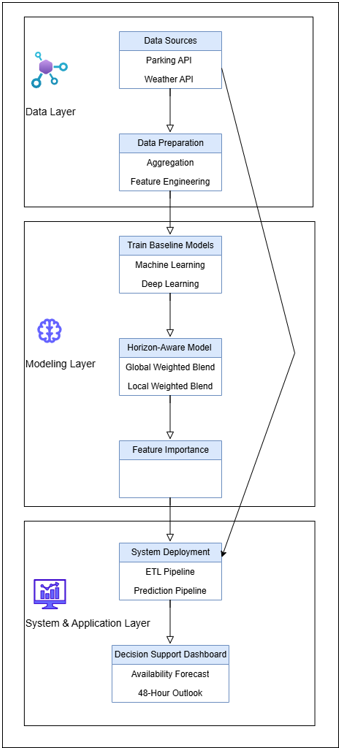

# Enhancing Decision Support in Urban Parking through Real-Time ML Pipelines and Interactive Dashboards
## A Case Study from Bamberg

**Master's Thesis Project** | University of Bamberg

---

## 🎯 Abstract

Urban parking congestion is a persistent challenge in modern cities, often leading to increased traffic, longer travel times, and higher levels of air pollution. A significant portion of urban traffic is caused by drivers searching for available parking spaces, highlighting the need for predictive systems that can provide reliable information about future parking availability.

This thesis investigates how machine learning techniques can be used to forecast parking availability and support data-driven decision making in urban mobility systems. The study compares classic machine learning methods and deep learning approaches and introduces a **horizon-aware hybrid forecasting model** designed to combine the strengths of different algorithms.

**Key Findings:**
- ✅ Hybrid models consistently outperform individual baseline models
- ✅ Temporal variables and recent occupancy statistics are the most influential predictors
- ✅ Forecasting framework successfully integrated into automated data pipeline
- ✅ Real-time predictive dashboard deployed for operational decision support

---

## 🔑 Key Features

- **Real-Time Data Collection**: Automated parking occupancy and weather data ingestion
- **Advanced ML Pipeline**: Hybrid ensemble models (Linear Regression + Neural Networks, Random Forest + Gradient Boosting)
- **Multi-Horizon Forecasting**: 24-hour predictions with horizon-specific alpha blending optimization
- **Interactive Dashboard**: Flask-based real-time visualization of predictions and analytics
- **Scalable Architecture**: Docker-containerized microservices deployed on AWS EC2
- **Production Ready**: Fully automated scheduler and comprehensive logging

---

## 🏗️ System Architecture



---

## � Project Organization

This repository consists of **two independent but complementary pipelines**:

### 🔄 **Training Pipeline** (`training_pipeline/`)
Offline batch processing for preparing training datasets from raw API data.

**Workflow:**
1. **Ingest parking data** from Parking Pilot API → PostgreSQL
2. **Ingest weather data** from Open-Meteo API → PostgreSQL
3. **Create minute-level tables** (1-minute granularity per parking lot)
4. **Aggregate to hourly** (60-minute average occupancy)
5. **Engineer features** (temporal variables, rolling windows, statistics)
6. **Generate training datasets** (ready for model training)

**Output:** Clean training datasets in Parquet format (`training_pipeline/src/scripts/parking_data_lot38.parquet`, `parking_data_lot634.parquet`) + trained ML models in `results/`


**Documentation:** See [Training Pipeline README](training_pipeline/README.md) for detailed setup and execution.

---

### 🚀 **Prediction Pipeline** (`prediction_pipeline/`)
Real-time production system for live predictions and interactive dashboard.

**Architecture:**
- **Data Collector**: Continuously ingests parking & weather data
- **Data Transformer**: Hourly aggregation and real-time feature engineering
- **Predictor**: Runs hybrid ML models (trained models from training pipeline)
- **Dashboard**: Flask web app displaying live predictions and analytics

**Deployment Options:**
- Local Docker stack (development/testing)
- AWS EC2 (production)

**Documentation:** See [Prediction Pipeline README](prediction_pipeline/README.md) 

---

## 📊 Project Structure

```
MASTERTHESIS_PYTHON/
├── README.md                              ← Project overview
├── master_thesis.pdf                      ← Final thesis document
├── system_overview.png                    ← Architecture diagram
├── .gitignore
│
│
├── prediction_pipeline/                   ← Real-time prediction system
│   └── ...                                ← (pipeline code, models, etc.)
│
├── training_pipeline/                     ← Data processing & training
│    └── ...


```

## 🚀 Quick Start - Clone & Run the Project

### **Prerequisites**

Before getting started, ensure you have installed:
- **Git** - [Download Git](https://git-scm.com/)
- **Python 3.9+** - [Download Python](https://www.python.org/downloads/)
- **PostgreSQL 15** - [Download PostgreSQL](https://www.postgresql.org/download/)
- **Docker** (optional, for prediction pipeline) - [Download Docker](https://www.docker.com/products/docker-desktop)

---

### **Step 1: Clone the Repository**

```bash
# Clone the repository
git clone https://github.com/aliostadi/Mastertheses_python.git

# Navigate to project directory
cd Mastertheses_python

# Check project structure
ls -la
```

---

### **Step 2: Choose Your Path**

This project has **two independent workflows**. Choose based on your needs:

#### **Option A: Train Models (Recommended for Data Scientists** 🤖)

To prepare data and train ML models:

```bash
# Navigate to training pipeline
cd training_pipeline

# Configure your credentials
cp src/config/settings.py.example src/config/settings.py
# Edit settings.py with your API credentials

# Run the automated setup and data preparation
# Windows:
prepare_training_data.bat

# macOS/Linux:
bash prepare_training_data.sh
```

**Expected Runtime:** ~30-60 minutes (depends on data size)

**Output:** 
- ✅ Trained models in `results/lot38/` and `results/lot634/`
- ✅ Parquet training data files in `src/scripts/`

**Full Guide:** See [Training Pipeline README](training_pipeline/README.md)

---

#### **Option B: Run Production Pipeline (Uses Pre-trained Models** 🎯)

To deploy the live prediction system with Docker:

```bash
# Navigate to prediction pipeline
cd prediction_pipeline

# Create environment configuration
touch .env
# Edit .env with your database and API credentials:
# DB_HOST=localhost
# DB_PORT=5432
# DB_NAME=parking
# DB_USER=parking_user
# DB_PASSWORD=your_password
# PARKING_API_USERNAME=FutureIOT_MOBI
# PARKING_API_PASSWORD=your_api_password

# Ensure trained models are in place
# (Copy from training_pipeline/results/)

# Build and run all services
docker-compose build
docker-compose up -d

# Access the dashboard
# Open browser: http://localhost:5000
```

**Full Guide:** See [Prediction Pipeline README](prediction_pipeline/README.md)

---

### **Step 3: Verify Installation**

**For Training Pipeline:**
```bash
# Check if virtual environment was created
ls -la env_python39/

# Check if data was prepared
ls -la src/scripts/parking_data_*.parquet
```

**For Prediction Pipeline:**
```bash
# Check if containers are running
docker-compose ps

# View logs
docker-compose logs -f dashboard
```

---

### **Step 4: Access Web Interface (Prediction Pipeline)**

Once running:
- **Dashboard:** http://localhost:5000
- **Database Admin (PgAdmin):** http://localhost:5050

---

### **Common Quick Start Commands**

| Task | Command |
|------|---------|
| Clone repo | `git clone https://github.com/yourusername/Mastertheses_python.git` |
| Prepare training data | `cd training_pipeline && prepare_training_data.bat` (Windows) or `bash prepare_training_data.sh` (Mac/Linux) |
| Start prediction services | `cd prediction_pipeline && docker-compose up -d` |
| View real-time logs | `docker-compose logs -f` |
| Stop all services | `docker-compose down` |
| Check data status | `psql -U parking_user -d parking -c "SELECT COUNT(*) FROM predictions_lot38;"` |

---
## � Documentation & Links

| Document | Contains |
|----------|----------|
| [**Training Pipeline README**](training_pipeline/README.md) | 📖 Detailed workflow & data preparation |
| [**Prediction Pipeline README**](prediction_pipeline/README.md) | 🏗️ Service architecture & API details |

---


## 📈 System Requirements

| Component | Specification |
|-----------|---------------|
| **Python** | 3.9+ |
| **Database** | PostgreSQL 15 |
| **Docker** | 20.10+ (for prediction pipeline) |
| **Memory** | 2GB minimum (4GB+ recommended) |
| **Storage** | 5GB minimum (10GB+ for historical data) |
| **Network** | Internet access for Parking Pilot API, Open-Meteo Weather API |


---

This project is part of a Master's thesis at the University of Bamberg.

**Data Sources:**
- Parking Pilot API (parking data provider)
- Open-Meteo (weather data)
- University of Bamberg (infrastructure)

| Issue | Solution |
|-------|----------|
| Database connection error | Check `.env`, ensure PostgreSQL is running, verify credentials |
| Missing predictions | Check transformer logs, ensure hourly aggregation completed |
| Dashboard not loading | Verify Flask is running: `docker-compose logs dashboard` |
| API authentication failed | Verify API credentials in `.env`, check token validity |
| Memory issues | Increase Docker memory limit: `docker-compose up --memory=4g` |


---

## 📄 Thesis Documentation

For comprehensive thesis details:
- **Title**: Enhancing Decision Support in Urban Parking through Real-Time ML Pipelines and Interactive Dashboards: A Case Study from Bamberg [**master_thesis.pdf**](master_thesis.pdf)
- **University**: University of Bamberg
- **Year**: 2026

---

## 📄 License

This project is for academic purposes. Usage outside academic context requires explicit permission.

---
## �‍💻 Authors & Contact

**Author:** Ali Ostadi

📧 **Email:** ali.ostadiy@gmail.com  
🔗 **LinkedIn:** [linkedin.com/in/aliostadi](https://www.linkedin.com/in/aliostadi/)


---

**Last Updated**: April 2026  
