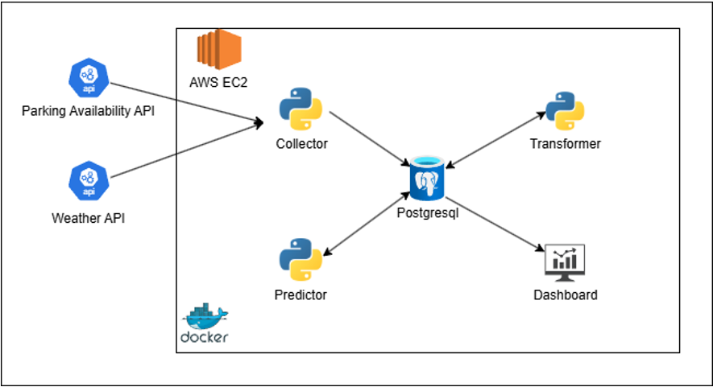

# Prediction Pipeline - Production Services

This is the **production environment** containing microservices that continuously fetch data, process it, and make parking availability predictions.

**Status**: Production deployment (runs on AWS or cloud servers, scheduled tasks)

---

## 🏗️ Architecture Overview



**Architecture Components:**
- **Parking Pilot APIs** - Real-time parking occupancy and weather data sources
- **Data Collector** - Fetches raw parking and weather data every 5-30 minutes
- **Data Transformer** - Aggregates minute-level data to hourly features
- **PostgreSQL Database** - Stores raw data, features, and predictions
- **Predictor Service** - Runs ML models to forecast parking availability hourly
- **Web Dashboard** - REST API and web UI for viewing predictions and historical data

---

## 📦 Services Overview

### **1. Data Collector** (`services/data_collector/`)

Continuously fetches data from external APIs and stores in database.

**Modules:**
- `collector.py` - Main parking occupancy data fetcher
- `weather_collector.py` - Weather data fetcher
- `Dockerfile.parking` - Container for parking data collection
- `Dockerfile.weather` - Container for weather data collection

**Frequency:** Typically every 5-30 minutes (configurable)

**Data stored:**
- `ali_parking_operations_YYYY_MM_DD` - Raw parking availability
- `weather_raw` - Raw weather readings

---

### **2. Data Transformer** (`services/data_transformer/`)

Processes raw data into features ready for prediction.

**Modules:**
- `feature_engineer.py` - Create temporal and statistical features
- `hourly_aggregator.py` - Aggregate minute-level data to hourly
- `transformer_scheduler.py` - Schedule hourly transformations
- `Dockerfile` - Container for transformation pipeline

**Frequency:** Hourly, after data collection

**Data created:**
- `parking_availability_hourly_lot38` - Features for Lot 38
- `parking_availability_hourly_lot634` - Features for Lot 634

---

### **3. Predictor** (`services/predictor/`)

Makes hourly parking availability predictions using trained ML models.

**Modules:**
- `parking_predictor.py` - Makes predictions using trained models
- `prediction_scheduler.py` - Schedule hourly predictions
- `Dockerfile` - Container for prediction service
- `models/` - Trained ML model weights (from training pipeline)

**Frequency:** Hourly, after data transformation

**Data created:**
-  Predictions for Lot 38
-  Predictions for Lot 634

**ML Models Used:**
- **Lot 38: Hybrid Ensemble**
  - Linear Regression
  - Encoder-Decoder (Neural Network)
  - Blended with optimal alpha weight

- **Lot 634: Hybrid Ensemble**
  - Random Forest
  - Gradient Boosting
  - Blended with optimal alpha weight

---

### **4. Dashboard** (`services/dashboard/`)

Web interface for viewing predictions and historical data.

**Technology:**
- Flask (Python backend)
- HTML/CSS/JavaScript frontend
- REST API endpoints

**Features:**
- Real-time parking availability predictions
- Historical occupancy trends
- Web interface (`http://localhost:5000`)
- API endpoints for mobile/external apps

**Files:**
- `app.py` - Flask application
- `templates/` - HTML templates
- `Dockerfile` - Container for dashboard

---

## � How to Run the Pipeline with Docker

### **Prerequisites**

Before running the pipeline, ensure you have:

1. **Docker** installed ([Download Docker Desktop](https://www.docker.com/products/docker-desktop))
2. **Docker Compose** installed (included with Docker Desktop)
3. **Trained ML Models** placed in `services/predictor/models/lot38/` and `services/predictor/models/lot634/`
4. **Environment Configuration** file (`.env`) with credentials

---

### **Step 1: Prepare Environment Configuration**

Create a `.env` file in the `prediction_pipeline/` directory with your credentials:

```bash
# prediction_pipeline/.env.example
# Copy this file to .env and fill in your actual values

# ====== DATABASE ======
DB_HOST=localhost              # For local: localhost or postgres
DB_PORT=5432                   # For local: 5432
DB_NAME=parking_predictions
DB_USER=parking_user
DB_PASSWORD=change_me_to_secure_password

PGADMIN_EMAIL=admin@parking.com
PGADMIN_PASSWORD=admin
# ====== PARKING API CREDENTIALS ======
# Get these from your parking data provider - if yu need to run the project you need credentials to access the parking API. please contact me via ali.ostadiy@gmail.com to get access to the API credentials for testing purposes.
PARKING_API_USERNAME=your_api_username_here
PARKING_API_PASSWORD=your_api_password_here

# ====== COLLECTOR SETTINGS ======
COLLECTION_INTERVAL_MINUTES=1

# ====== DASHBOARD ======
DASHBOARD_PORT=5000
DASHBOARD_DEBUG=false

# ====== MODELS ======
MODEL_DIR=/app/models
```

> ⚠️ **Important**: Never commit `.env` file to git. It's listed in `.gitignore` for security.

---

### **Step 2: Verify Trained Models Are Present**

Ensure trained models from the training pipeline are in place:

```bash
# Check Lot 38 models
ls -la services/predictor/models/lot38/
# Should show: linear_regression_model.pkl, encoder_decoder_model.keras, local_weighted_blend_hybrid_metadata.json

# Check Lot 634 models
ls -la services/predictor/models/lot634/
# Should show: random_forest_model.pkl, gradient_boosting_model.pkl, local_weighted_blend_hybrid_metadata.json
```

---

### **Step 3: Build Docker Images**

Build all service images:

```bash
# Navigate to prediction_pipeline directory
cd prediction_pipeline

# Build all images
docker-compose build

# Output should show:
# → Building postgres
# → Building pgadmin
# → Building data_collector_parking
# → Building data_collector_weather
# → Building data_transformer
# → Building predictor
# → Building dashboard
```

---

### **Step 4: Start All Services**

Start the entire prediction pipeline in the background:

```bash
# Start all containers in detached mode
docker-compose up -d

# Output should show:
# ✓ Network prediction_pipeline_default created
# ✓ Container postgres started
# ✓ Container pgadmin started
# ✓ Container data_collector_parking started
# ✓ Container data_collector_weather started
# ✓ Container data_transformer started
# ✓ Container predictor started
# ✓ Container dashboard started
```

---

### **Step 5: Verify Services Are Running**

Check that all containers are healthy:

```bash
# View all running containers
docker-compose ps

# Expected output (all should be "Up"):
# NAME                              STATUS
# postgres                           Up (healthy)
# pgadmin                            Up
# data_collector_parking             Up
# data_collector_weather             Up
# data_transformer                   Up
# predictor                          Up
# dashboard                          Up
```

---

### **Step 6: Access Services**

Once all services are running, access them:

**Web Dashboard:**
- URL: `http://localhost:5000`
- View real-time parking predictions and historical data

**PgAdmin (Database Management):**
- URL: `http://localhost:5050`
- Username: `admin@example.com`
- Password: (set in `.env`)

**API Endpoints:**
- Dashboard API: `http://localhost:5000/api`
- Check status: `curl http://localhost:5000/api/status`

---

### **Step 7: Monitor Logs**

View real-time logs from all services:

```bash
# View all service logs
docker-compose logs -f

# View specific service logs
docker-compose logs -f predictor          # ML predictions only
docker-compose logs -f data_transformer   # Data processing only
docker-compose logs -f data_collector_parking  # Parking data collection

# Follow only recent logs (last 50 lines)
docker-compose logs -f --tail=50
```

---

### **Step 8: Verify Data Flow**

Check that data is being processed correctly:

```bash
# Connect to PostgreSQL container
docker-compose exec postgres psql -U parking_user -d parking

# Inside psql, check table row counts:
SELECT COUNT(*) FROM ali_parking_operations_2026_05_02;
SELECT COUNT(*) FROM weather_raw;
SELECT COUNT(*) FROM parking_availability_hourly_lot38;
SELECT COUNT(*) FROM parking_availability_hourly_lot634;
SELECT COUNT(*) FROM predictions_lot38;
SELECT COUNT(*) FROM predictions_lot634;

# Exit psql
\q
```

---

### **Common Docker Commands**

| Command | Purpose |
|---------|---------|
| `docker-compose up -d` | Start all services in background |
| `docker-compose down` | Stop all services (removes containers) |
| `docker-compose ps` | Show running containers status |
| `docker-compose logs -f` | View live logs from all services |
| `docker-compose restart predictor` | Restart a specific service |
| `docker-compose build --no-cache` | Rebuild images (force fresh build) |
| `docker-compose exec predictor bash` | Open shell in running container |

---

### **Troubleshooting**

| Issue | Solution |
|-------|----------|
| `Connection refused` on dashboard | Wait 30 seconds for containers to initialize, then refresh |
| `Database connection error` | Check `.env` credentials, ensure postgres container is healthy |
| `API authentication failed` | Verify PARKING_API_USERNAME/PASSWORD in `.env` |
| `Models not found` | Ensure trained model files are in `services/predictor/models/` |
| `Port already in use` | Change port numbers in `.env` (e.g., DASHBOARD_PORT=5001) |
| `Out of disk space` | Run `docker system prune` to clean up old images/volumes |

---

### **Stopping the Pipeline**

To stop all services:

```bash
# Stop all containers (without deleting)
docker-compose stop

# Stop and remove all containers
docker-compose down

# Stop and remove everything (including volumes/data)
docker-compose down -v
```

---

## �🔄 Data Flow Timeline

### **Typical Daily Flow:**

```
00:05 → Data Collector: Fetch parking data
00:10 → Data Collector: Fetch weather data
00:15 → Data Transformer: Aggregate to hourly features
00:20 → Predictor: Make predictions for 01:00
(Repeat every hour)
```

### **Database Schema:**

```
Raw Data (Ingestion)
├─ ali_parking_operations_YYYY_MM_DD
│  ├─ parking_lot_id
│  ├─ parking_space_id
│  ├─ arrival_unix_seconds
│  ├─ departure_unix_seconds
│  └─ [space state changes]
│
└─ weather_raw
   ├─ timestamp
   ├─ temperature_2m
   ├─ relative_humidity_2m
   ├─ precipitation
   └─ [other weather metrics]

Processed Data (Hourly)
├─ parking_availability_hourly_lot38
│  ├─ hour_timestamp
│  ├─ avg_free_spaces
│  ├─ avg_occupancy_rate
│  ├─ parking features
│  └─ weather features
│
└─ parking_availability_hourly_lot634
   ├─ [same structure]

Predictions (Hourly)
├─ predictions_lot38
│  ├─ predicted_timestamp
│  ├─ predicted_occupancy
│  ├─ confidence_score
│  └─ model_version
│
└─ predictions_lot634
   ├─ [same structure]
```

---

## 🔗 Related Documentation

- [Training Pipeline](../training_pipeline/README.md) - How models are trained
- [Main README](../README.md) - Project overview

---

**Last Updated**: April 2026
